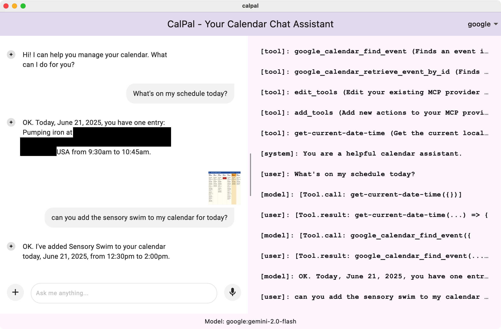

# CalPal

A chat-based calendar assistant using [the Flutter AI
Toolkit](https://docs.flutter.dev/ai-toolkit) and [the Dartantic AI agentic
framework](https://pub.dev/packages/dartantic_ai). Talk with your Google
Calendar to check your schedule, create events, and manage your time, with a
choice of Gemini or OpenAI LLMs.

The screenshot above shows CalPal in action. The user asks for their schedule,
and the AI assistant, powered by `dartantic_ai`, performs a multi-step
tool-calling sequence
- it calls the `get-current-date-time` tool to understand the context of
  "today". 
- it uses that date to call the `google_calendar_find_event` tool to fetch the
  schedule. 

CalPal does this in a single request-response because [Dartantic supports
multi-turn tool
calling](https://pub.dev/packages/dartantic_ai#agentic-behavior-multi-vs-single-step-tool-calling)
aka "Agent Mode". The right-hand pane shows the tools the agent is working with
and the messages passing through the agent during the process.

The second prompt is just for fun. I uploaded a screenshot of the schedule for
my local pool and asked it to add a particular swimming session to my calendar.
Which it did. And now I'm late for it as I write this. : )

## Tools and MCP Servers and LLMs, Oh My!

The calendar manipulation functionality comes from the MCP server that Zapier
let me create and attach to my Google Calendar. There is almost no
calendar-specific functionality in this app (just a little bit in the system
prompt). There is zero Zapier-specific functionality -- it's all about what MCP
servers you configure and tools you pass in.

## Setup

Before running this sample, you'll need to [set up a MCP CLI Proxy MCP
Server](https://mcp.zapier.com/) on Zapier.

You'll want the transport to be set to *Streamable HTTP* and grab the *Server
URL*.

Set that URL to the `ZAPIER_MCP_URL` environment variable and make sure it's
available in your app's environment.

Also you'll need `GEMINI_API_KEY` and/or `OPENAI_API_KEY` your environment,
depending on whether you want to use the Gemini or OpenAI models.

Or you don't need anything in your environment. You can pass these values in
manually via the `McpClient` and `Agent` classes if you'd rather. Environmental
variables by convention are great for server-side uses, so I just built them in
but they're not required.

And of course, the web doesn't support an environment and my plan is to target
Flutter Web with Dartantic. Unfortunately that support is not there yet, since
Dartantic depends on [the mcp_dart package](https://pub.dev/packages/mcp_dart),
which doesn't support the web yet, but [web support is
coming](https://github.com/csells/dartantic_ai/issues/13)!

## Thanks!
Huge shout-out to [Jhin Lee](https://github.com/leehack) and [David Miguel
Lozano](https://github.com/davidmigloz) who both turned around non-trivial
changes very quickly so I could pull this sample together. Check out their stuff!
They both do amazing work.